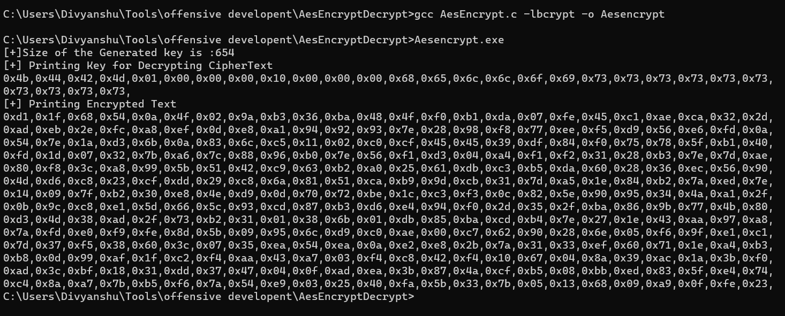
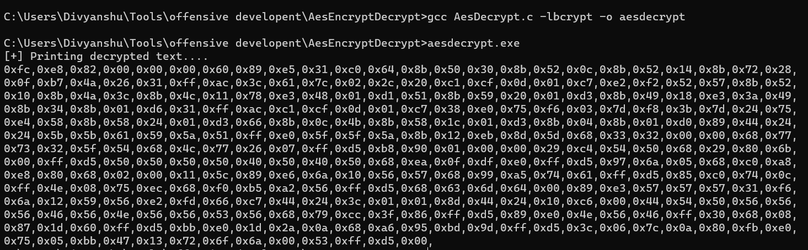
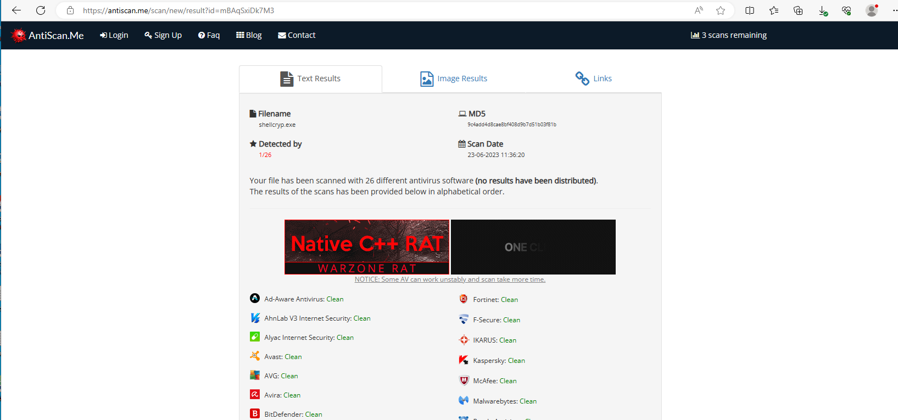

## AesEncryptDecrypt

### About
It's a AES shellcode encryptor/decryptor which can be used for bypassing various Antivirus Engines.

### Usage

- Change the shellcode and key in the AesEncrypt.c
- Bcrypt Library is necessary for compiling the binary
- Compile the biary using GCC
``` gcc AesEncrypt.c -lbcrypt -o AesEncrypt```
- Run the AesEncrypt.exe , you will get the Encrypted CipherText
- For Decryption, change the encrypted shellcode and key , which is obtained from AesEncrypt.exe
- Use the code, as a part of your malware

### Compatibility
```
gcc (Rev10, Built by MSYS2 project) 12.2.0
Copyright (C) 2022 Free Software Foundation, Inc.
This is free software; see the source for copying conditions.  There is NO
warranty; not even for MERCHANTABILITY or FITNESS FOR A PARTICULAR PURPOSE.
```

### Working




### Future Works

- Use of Initialization Vector

### References
- This API was used by Emotet Malware for encrypting the Shellcode. Ref: https://www.vmray.com/cyber-security-blog/malware-analysis-spotlight-emotets-use-of-cryptography/ 
